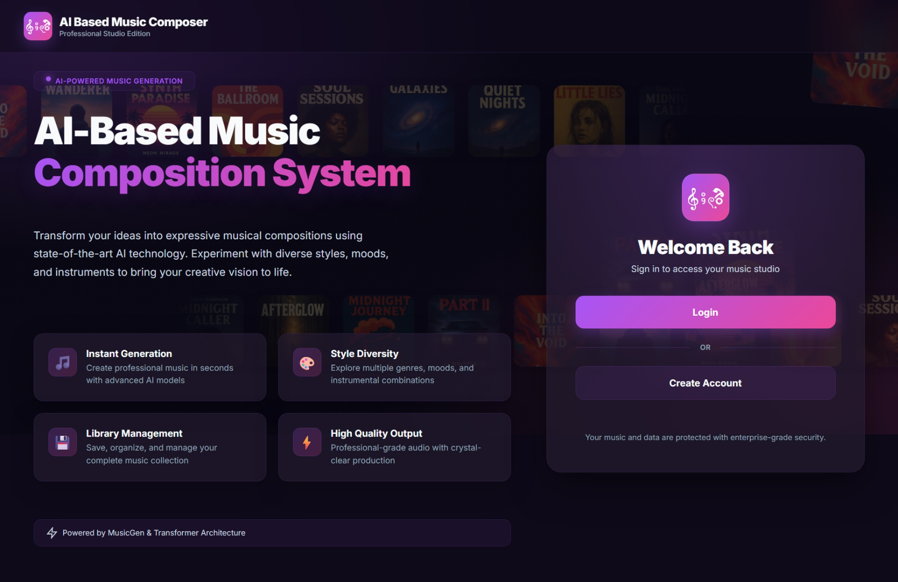
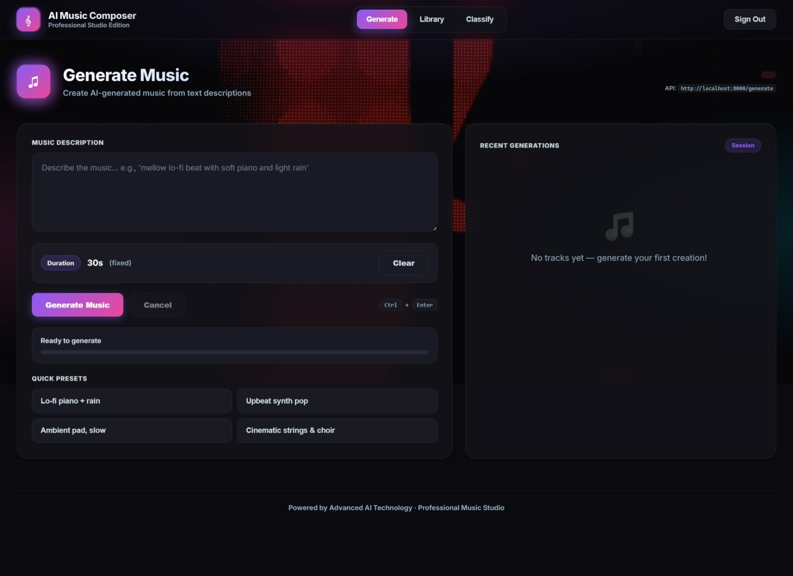
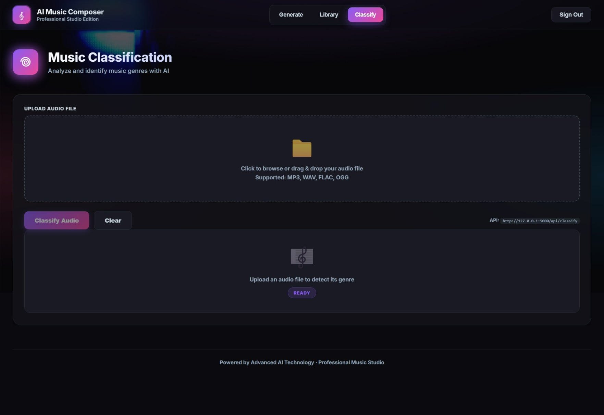

## AI-Based Music Composition System
An end-to-end AI-powered system that generates unique instrumental music tracks from simple text prompts and also supports audio genre classification.

Built as part of Infosys Springboard Virtual Internship 6.0, this project combines AI, Machine Learning, and Full-Stack Development to automate music creation.

## Project Overview
This system allows users to:
### 1.🎵 Generate music using text prompts (via MusicGen)
### 2. 🎧 Classify uploaded audio into genres (using YAMNet)
### 3. 📚 Store and manage generated tracks
### 4. ⚡ Experience real-time AI-powered music creation
## Key Features

1. **AI Music Generation**: Creates custom instrumental music from text prompts using MusicGen AI model
2. **Text-to-Music**: Converts descriptive text prompts (e.g., "happy energetic pop music") into actual music tracks
3. **Audio Genre Classification**: Classifies music files into 10 different genres using TensorFlow/Keras
4. **Professional UI**: Modern, responsive web interface with dark mode and gradient animations
5. **Complete Full-Stack System**: Works together with backend Flask API and frontend React app

## Technologies Used

- **Frontend**: React.js, HTML5, CSS3
- **Backend**: Python, Flask  (Genre Classification API), FastAPI (Music Generation API)
- **AI Models**: Facebook MusicGen (HuggingFace), TensorFlow/Keras, YAMNet(Audio Classification)
- **Libraries**: PyTorch, TensorFlow, librosa, transformers, audiocraft
- **Deployment**: Local development environment

## Repository Structure

```
AI-Music-Generation-System_Infosys/
│
├── assets/ # UI images, icons, and frontend assets
│
├── backend/ # Backend (Flask - Genre Classification)
│ ├── models/ # Trained ML models
│ │ └── yamnet_gtzan... # Saved YAMNet + GTZAN classifier model
│ │
│ ├── app.py # Flask API for genre classification
│ ├── extract_embeddings.py # Feature extraction using YAMNet
│ ├── gtzan.py # Genre prediction logic
│ └── train_classifier.py # Model training script
│
├── data/ # Dataset & processed features
│ ├── gtzan/ # GTZAN dataset (audio files)
│ ├── images_original/ # Dataset images (if used)
│ ├── features_3_sec.csv # Extracted features (3 sec clips)
│ ├── features_30_sec.csv # Extracted features (30 sec clips)
│ └── gtzan_embeddings... # Precomputed embeddings
│
├── musicgen_model.py # Music generation logic (MusicGen)
├── server.py # FastAPI server for music generation
│
├── index.html # Main frontend UI (music generation)
├── home.html # Landing / login page
│
├── .gitignore # Git ignore file
├── README.md # Project documentation
│
└── venv/ # Virtual environment (ignored)
```

## Project Screenshots

### 1.Login Page

### 2.Music Generation UI

### 3. Music Library

### 4. Genre Classification



Follow these steps to run the project locally:

### Prerequisites

- Python 3.8+
- Node.js 16+
- npm
- pip
- Git

### Step 1: Clone Repository

```bash
git clone https://github.com/your-username/musicgen-project.git
cd musicgen-project

### Step 2: Create Virtual Environment
```bash
python -m venv venv
venv\Scripts\activate
```

### Step 3: Install Dependencies
```bash
pip install --upgrade pip
pip install flask flask-cors fastapi uvicorn
pip install torch torchaudio audiocraft
pip install tensorflow tensorflow-hub
pip install librosa soundfile numpy scikit-learn matplotlib
pip install transformers sentencepiece
```

# Running the Project
### 1. Start Genre Classification Server (Flask)
```bash
cd backend
python app.py
```
Runs on0: http://127.0.0.1:5000

### 2. Start Music Generation Server (FastAPI)
Open new terminal:
```bash
cd project-root
venv\Scripts\activate
python -m uvicorn server:app --host 127.0.0.1 --port 8000 --reload
```
Runs on: http://127.0.0.1:8000
API Docs: http://127.0.0.1:8000/docs

### 3. Run Frontend
Open
```bash
index.html
```
OR run using Live Server (VS Code)
### API Endpoints
Generate Music
```bash
POST /generate
```
Body:
```bash
{
  "prompt": "lofi chill piano",
  "duration": 5
}
```
Classify Audio
```bash
POST /classify
```
## Future Scope
☁️ Cloud deployment (AWS / GCP)
🎚️ Real-time audio editing tools
👥 Multi-user collaboration
🎧 Spotify / SoundCloud integration

## Acknowledgements
Infosys Springboard
Meta AI (MusicGen)
TensorFlow Hub (YAMNet)
Hugging Face

## Author

Harshdeep Sharma
B.Tech CSE (AI/ML)
AI Developer | Builder | Innovator